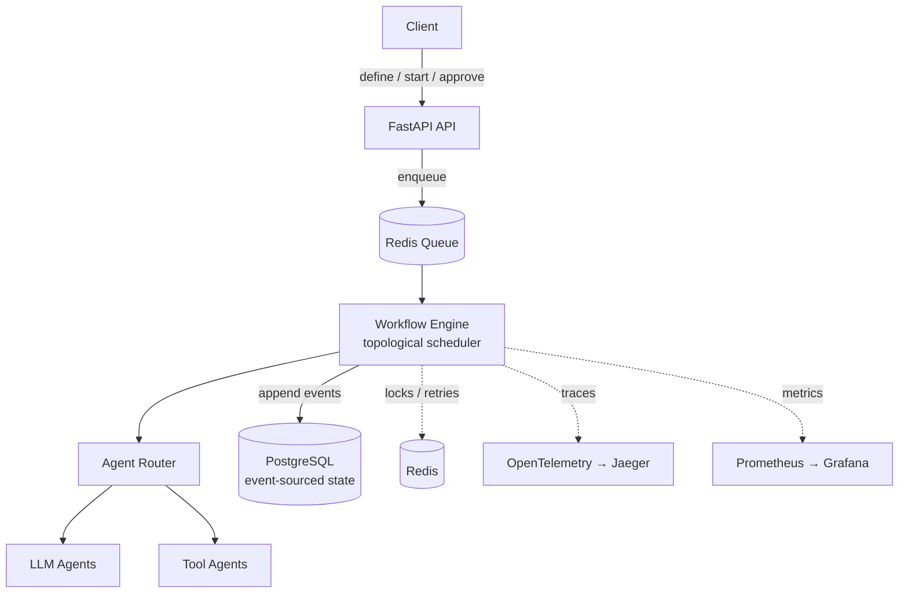

# AgentOS

**A control plane for durable, observable, human-in-the-loop LLM agent workflows.**

Define a workflow as a DAG of agent steps. AgentOS runs it durably — surviving crashes,
never double-running a step, pausing for human approval, and emitting a full trace and
cost breakdown for every run.

The interesting part isn't calling LLMs. It's the distributed-systems layer around them:
**durable execution, idempotency, retries without corruption, suspended workflows, and
observability.** See [DESIGN.md](./DESIGN.md) for the architecture and the decisions
behind it.

---

## Why this exists

A notebook chaining three agent calls works until something real happens — the process
crashes mid-run, a model call times out, a step needs sign-off, or you need to explain
why run #4821 cost $2.10. AgentOS handles those.

## Architecture (at a glance)



PostgreSQL is the source of truth (append-only event log). Redis is the speed layer
(locks, retry timers, cache) and is safe to flush.

## Quick start

```bash
cp .env.example .env
docker compose up -d            # postgres + redis
pip install -e ".[dev]"
alembic upgrade head            # (Phase 1+) create schema
uvicorn agentos.api.main:app --reload
```

Define and run a workflow:

```bash
# register an agent
curl -X POST localhost:8000/agents -d @examples/echo_agent.json

# define a workflow
curl -X POST localhost:8000/workflows -d @examples/hello_workflow.json

# start a run
curl -X POST localhost:8000/workflows/hello/runs

# watch it
curl localhost:8000/runs/{run_id}
```

## Roadmap

This is built in public, in phases, each ending in a tagged release and a writeup.
See [ROADMAP.md](./ROADMAP.md).

| Phase | Ships | Status |
|-------|-------|--------|
| 0 · Walking skeleton | API + Postgres + Redis up, single-step run end-to-end | 🟡 in progress |
| 1 · Durable execution | Event-sourced state, idempotent steps, crash-resume | ⚪ planned |
| 2 · DAG orchestration | Parallel branches, agent versioning, retries + DLQ | ⚪ planned |
| 3 · HITL + observability | Approval gates, OpenTelemetry, cost dashboard | ⚪ planned |
| 4 · UI (optional) | React run visualizer over the event log | ⚪ planned |

## Engineering writeups

Each phase produces an article on a distributed-systems problem solved here:
- Idempotency Beyond API Keys
- Durable Execution: Resuming Workflows After a Crash
- Retry Without Data Corruption
- Suspended Workflows: Human Approval as a First-Class State

(See [`docs/blog/`](./docs/blog).)

## License

MIT
